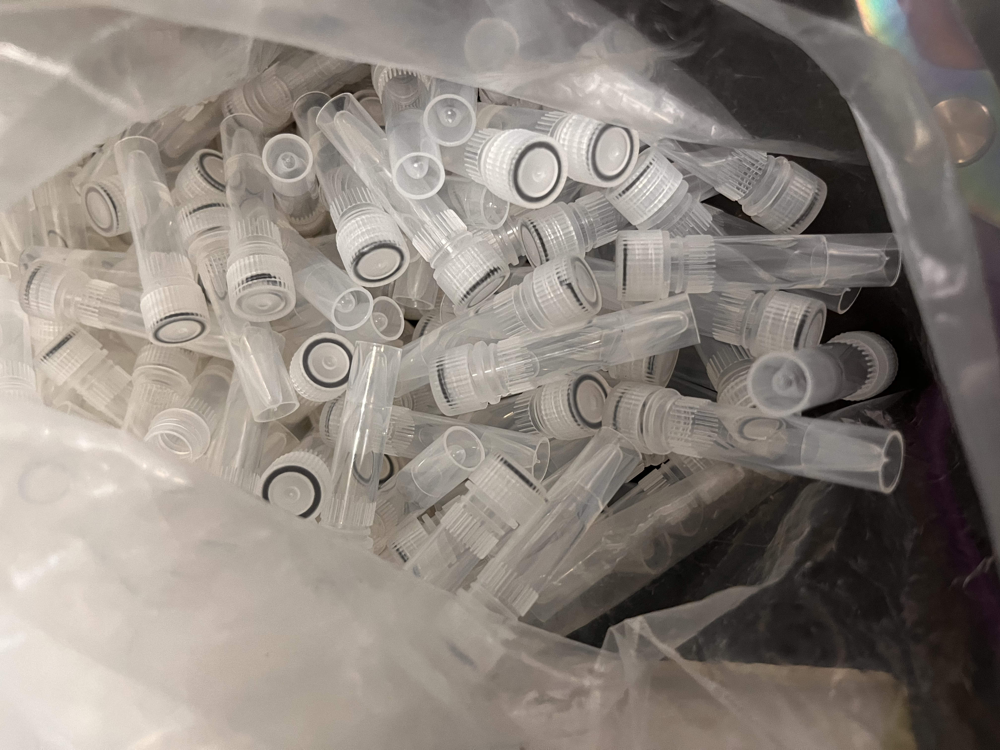
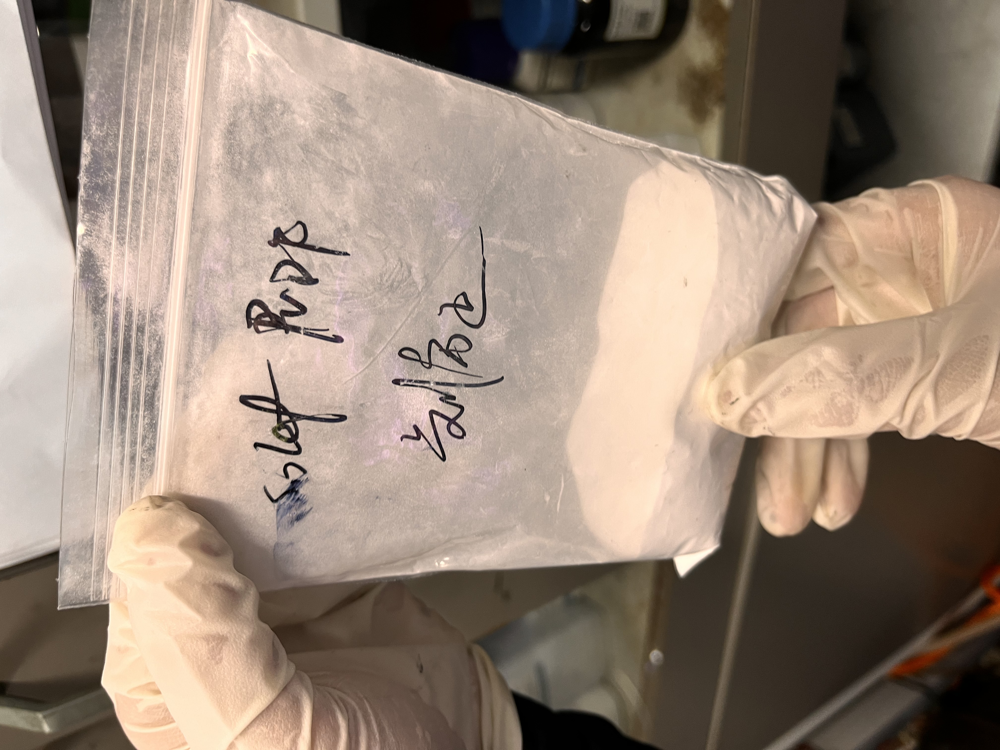
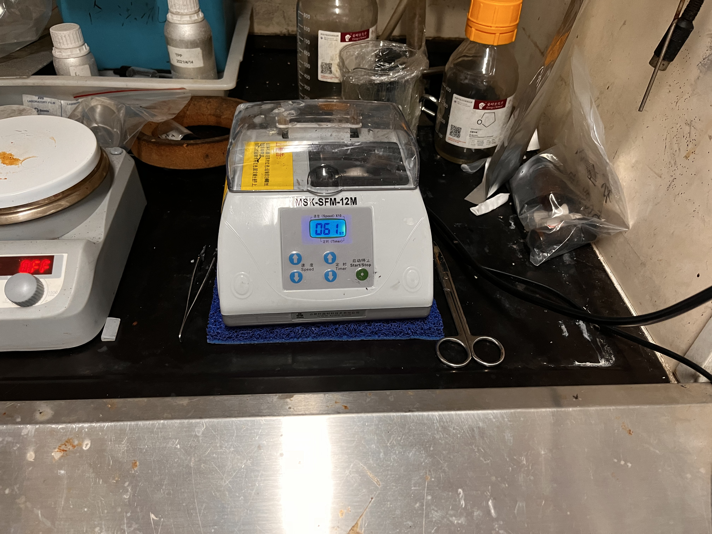
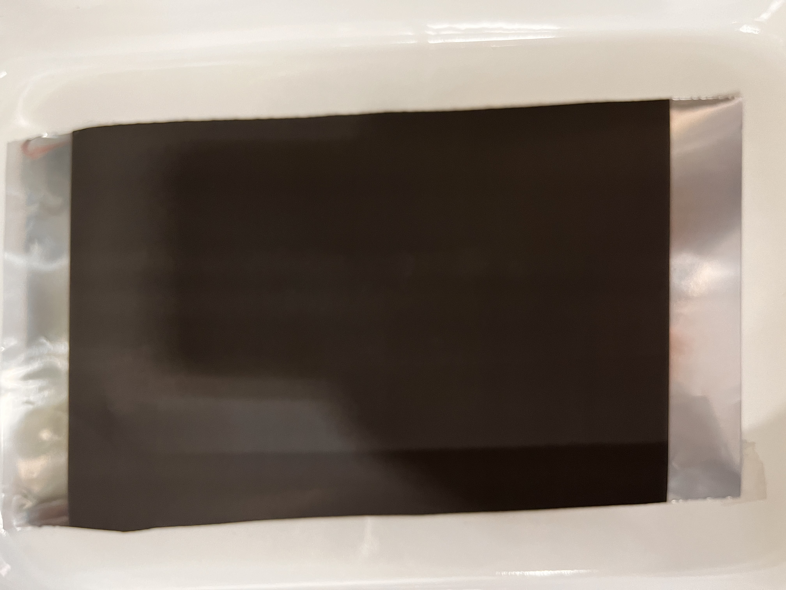
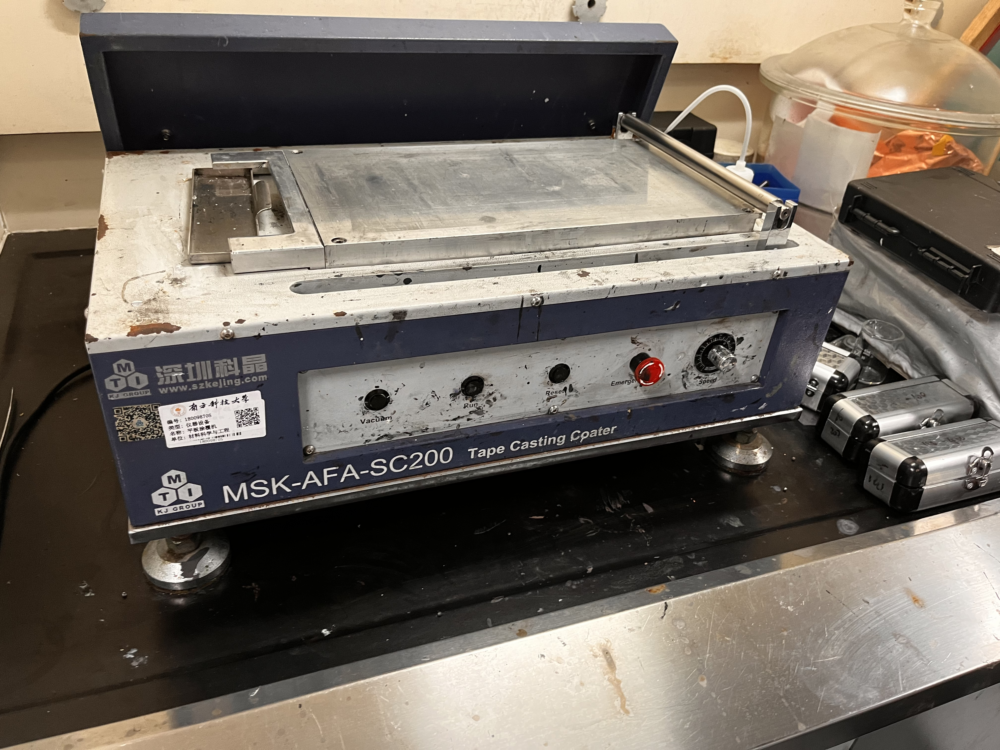

This blog provides an experimental procedure for electrode coating in the context of secondary battery research. It covers the preparation of slurry, electrode preparation using an aluminum foil collector, the coating process, and the necessary clean-up steps.

# 1. Preparation of Slurry:

1. Active material: NFM
2. Conductive agent: Carbon black
3. Binder: PVDF

Their mass ratio is 8:1:1, but this ratio is not fixed and depends on the experiment's requirements. Next, place the raw materials in a plastic bottle and add three zirconia beads. Seal the bottle and perform ultrasonic oscillation five times, each time for 180 seconds, to ensure the slurry is uniformly dispersed. If the slurry is too viscous, you can dilute it by adding 100 microliters of NMP each time.

<aside>
  
It is important to mention that the adhesive PVDF is dispersed in NMP. For this experiment, an NMP solution with a concentration of **5% PVDF** was utilized. The specific preparation method involves adding 0.5g of solid PVDF powder to 9.5g of liquid NMP solution in a 20 mL glass bottle, and then stirring the mixture with a magnetic stir bar at 60 degrees.

</aside>

# 2. Electrode Preparation

During the slurry preparation, it is necessary to prepare an electrode collector. In this experiment, a collector made of aluminum foil coated with conductive carbon black is used. The purpose of using such a collector is to enhance the conductivity of the electrode and improve its performance.

1. Prevent corrosion of the current collector.
2. Prevent excessive occurrence of side reactions.
3. Prevent detachment of positive electrode materials.

<aside>
Transfer the trimmed current collector into a clean tray to the coating machine. Open the vacuum button on the coating machine to use atmospheric pressure for adsorbing the current collector. It's important to note that the current collector cannot cover all the pores completely, which means that some of the pores are connected to the atmosphere. Using a vacuum pump to pump air is dangerous as it can reduce the machine's lifespan. Moreover, dust in the air can block the pores and hinder the effective adsorption of the current collector, which is not suitable for coating.

</aside>

# 3. Coating

1. Pour the uniform slurry onto the collecting medium.
2. Use tweezers to remove the zirconia beads.
3. Prepare the scraper.
4. Depending on the specific situation, choose the spacing of the scraper and the coating speed.
    - If a larger loading amount is needed, select a scraper with a larger spacing.
    - If the surface quality of the scraper is not good, choose a faster speed.

After applying the coating, place it in a vacuum oven and set the program to 60 degrees for 720 minutes.

# 4. Wrapping up work

1. Clean the coating machine and any other equipment used in the experiment.
2. Properly dispose of any leftover coating material or waste according to the guidelines.
